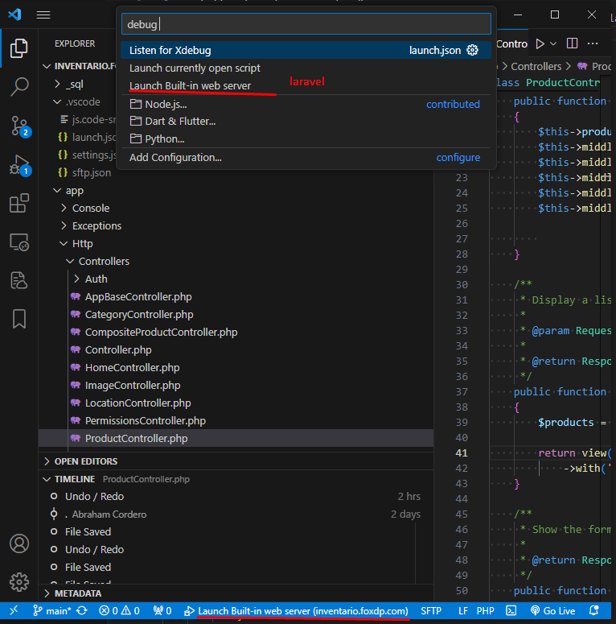

**Instrucciones:**

1. Descargar el archivo DLL desde https://xdebug.org/download#releases.
2. Pegarlo en la siguiente ruta: C:\laragon\bin\php\php-8.1.10-Win32-vs16-x64\ext.
3. Configurar el archivo php.ini.
4. Instalar la extensión PHP Debug.
5. La extensión configurará automáticamente un lanzamiento que se ubicará en la carpeta .vscode\launch.json.
6. Ejecutar -> Iniciar depuración o presionar F5.
7. Se puede elegir la configuración de depuración en la parte inferior; seleccionar "Launch Built-in web server" para visualizar en el navegador.

**Anexo:**




Configuración php.ini:
```ini
zend_extension = "php_xdebug.dll"
xdebug.mode = debug
xdebug.start_with_request = yes
xdebug.client_host = 127.0.0.1
xdebug.client_port = 9003
```

Configuración del launch.json:
```json
{
    "version": "0.2.0",
    "configurations": [
        {
            "name": "Listen for Xdebug",
            "type": "php",
            "request": "launch",
            "port": 9003
        },
        {
            "name": "Launch currently open script",
            "type": "php",
            "request": "launch",
            "program": "${file}",
            "cwd": "${fileDirname}",
            "port": 0,
            "runtimeArgs": [
                "-dxdebug.start_with_request=yes"
            ],
            "env": {
                "XDEBUG_MODE": "debug,develop",
                "XDEBUG_CONFIG": "client_port=${port}"
            }
        },
        {
            "name": "Launch Built-in web server",
            "type": "php",
            "request": "launch",
            "runtimeArgs": [
                "-dxdebug.mode=debug",
                "-dxdebug.start_with_request=yes",
                "-S",
                "localhost:0"
            ],
            "program": "",
            "cwd": "${workspaceRoot}",
            "port": 9003,
            "serverReadyAction": {
                "pattern": "Development Server \\(http://localhost:([0-9]+)\\) started",
                "uriFormat": "http://localhost:%s",
                "action": "openExternally"
            }
        }
    ]
}
```
